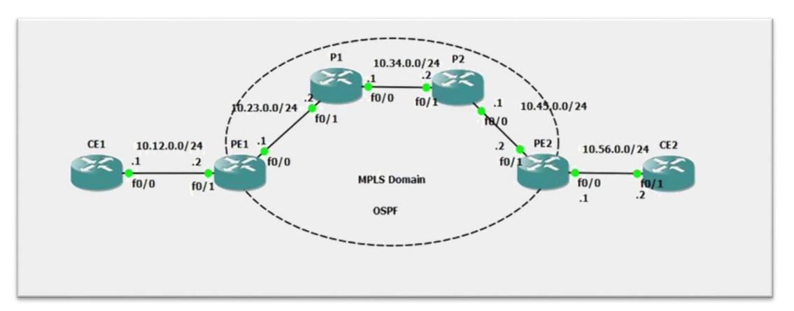

# Multiprotocol Label Switching

## From [wikipedia](https://en.wikipedia.org/wiki/Multiprotocol_Label_Switching)

- In an MPLS network, labels are assigned to data packets. Packet-forwarding decisions are made solely on the contents of this label
- MPLS works by prefixing packets with an MPLS header, containing one or more labels. This is called a label stack.

for more details check:

1. [Wikipedia](https://en.wikipedia.org/wiki/Multiprotocol_Label_Switching)
2. [LIVE: Let's learn MPLS with Kelvin Tran!](https://www.youtube.com/watch?v=J7I0DUKCX9c&t=1382s)
3. [How to Configure MPLS on Cisco Router - MPLS Configuration Step by Step - CCIE CCNP](https://www.youtube.com/watch?v=V9ij7se6VDw)

## Difference between layer 3 packet switching and label switching

- every router in the network will have to analyze and decapsulate the packet
- in label switching, the header decapsulation is done only once THEN the information is replaced with a label.
- one more difference is that labels are swapped later only by a table lookup of a given label.

> the MPLS forwarding table lookup process is both straightforward and fast.

## How to configure MPLS (According to cisco)

- reference: [MPLS configuration according to cisco](https://www.cisco.com/c/en/us/td/docs/ios-xml/ios/mp_basic/configuration/xe-16/mp-basic-xe-16-book/multiprotocol-label-switching-mpls-on-cisco-routers.html)

1. Configuring a Router for MPLS Switching.

```bash
enable
configure terminal
ip cef distributed
```

2. Verifying Configuration of MPLS Switching.

```bash
show ip cef summary
```
> [!WARNING]
> if you see `%CEF not running`, know that CEF is not running.

3. Configuring a Router for MPLS Forwarding:

Enable mpls forwarding (the use of labels) for IPv4 traffic (which is the normally routed path usually).

```bash
enable
configure terminal
interface type slot / subslot / port [. subinterface ]
mpls ip
end
```

> What to do next?
> Configure either of the following:
> - MPLS Label Distribution Protocol (LDP). For information about configuring MPLS LDP, see the MPLS Label Distribution Protocol Configuration Guide.
> - Static labels. For information about configuring static labels, see MPLS Static Labels.

4. Verifying Configuration of MPLS Forwarding

```bash
show mpls interfaces detail
```
#### example

```bash
Device# show mpls interfaces detail

Interface GigabitEthernet1/0/0:
         IP labeling enabled (ldp)
         LSP Tunnel labeling not enabled
         MPLS operational
         MTU = 1500
Interface POS2/0/0:
         IP labeling enabled (ldp)
         LSP Tunnel labeling not enabled
         MPLS not operational
         MTU = 4470
```

## TP MPLS



### 1. Configurer Routage

Check `./scripts/rip.py` for automatic config. (make sure you have the same topology)

> Results of routing config is in `./results/rip.txt`

### 2. Configurer Les routeurs dans le Domain MPLS sauf les CErouteurs.
### 3. Tester la connectivité.
### 4. Vérifier le trafic dans le Domain MPLS.
### 5. Analyser les Labels via wireshark.
### 6. Analyser LDP via wireshark.

