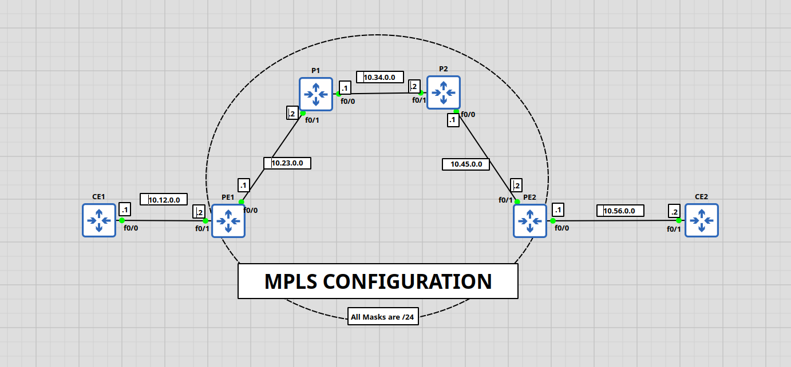
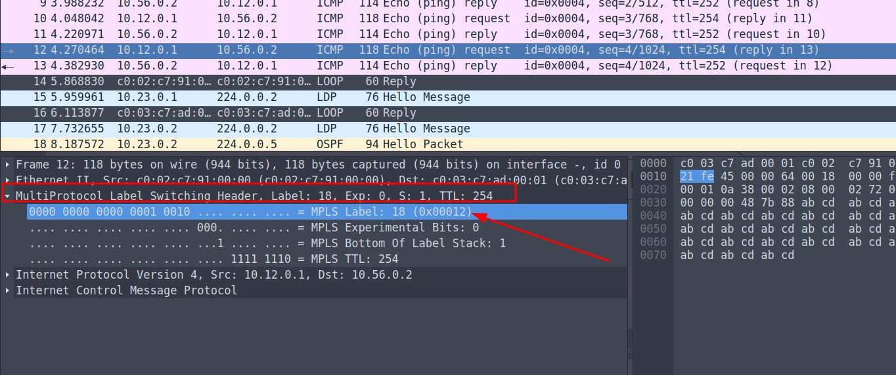
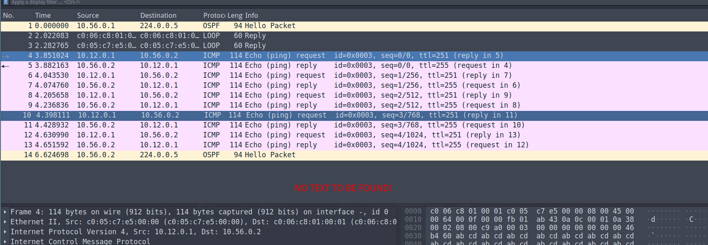
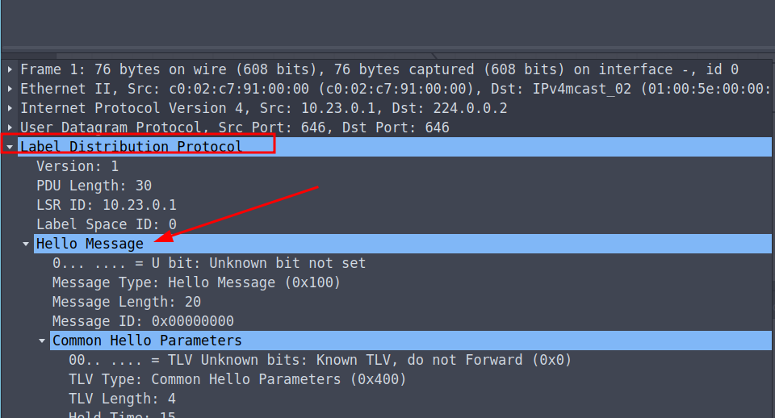

# Multiprotocol Label Switching

## From [wikipedia](https://en.wikipedia.org/wiki/Multiprotocol_Label_Switching)

- In an MPLS network, labels are assigned to data packets. Packet-forwarding decisions are made solely on the contents of this label
- MPLS works by prefixing packets with an MPLS header, containing one or more labels. This is called a label stack.

for more details check:

1. [Wikipedia](https://en.wikipedia.org/wiki/Multiprotocol_Label_Switching)
2. [LIVE: Let's learn MPLS with Kelvin Tran!](https://www.youtube.com/watch?v=J7I0DUKCX9c&t=1382s)
3. [How to Configure MPLS on Cisco Router - MPLS Configuration Step by Step - CCIE CCNP](https://www.youtube.com/watch?v=V9ij7se6VDw)

## Difference between layer 3 packet switching and label switching

- every router in the network will have to analyze and decapsulate the packet
- in label switching, the header decapsulation is done only once THEN the information is replaced with a label.
- one more difference is that labels are swapped later only by a table lookup of a given label.

> the MPLS forwarding table lookup process is both straightforward and fast.

## How to configure MPLS (According to cisco)

- reference: [MPLS configuration according to cisco](https://www.cisco.com/c/en/us/td/docs/ios-xml/ios/mp_basic/configuration/xe-16/mp-basic-xe-16-book/multiprotocol-label-switching-mpls-on-cisco-routers.html)

1. Configuring a Router for MPLS Switching.

```bash
enable
configure terminal
ip cef distributed
```

2. Verifying Configuration of MPLS Switching.

```bash
show ip cef summary
```
> [!WARNING]
> if you see `%CEF not running`, know that CEF is not running.

3. Configuring a Router for MPLS Forwarding:

Enable mpls forwarding (the use of labels) for IPv4 traffic (which is the normally routed path usually).

```bash
enable
configure terminal
interface type slot / subslot / port [. subinterface ]
mpls ip
end
```

> What to do next?
> Configure either of the following:
> - MPLS Label Distribution Protocol (LDP). For information about configuring MPLS LDP, see the MPLS Label Distribution Protocol Configuration Guide.
> - Static labels. For information about configuring static labels, see MPLS Static Labels.

4. Verifying Configuration of MPLS Forwarding

```bash
show mpls interfaces detail
```
#### example

```bash
Device# show mpls interfaces detail

Interface GigabitEthernet1/0/0:
         IP labeling enabled (ldp)
         LSP Tunnel labeling not enabled
         MPLS operational
         MTU = 1500
Interface POS2/0/0:
         IP labeling enabled (ldp)
         LSP Tunnel labeling not enabled
         MPLS not operational
         MTU = 4470
```

## TP MPLS



### 1. Configurer Routage

Check `ospf` directory to configure ospf.

1. configure ip addresses in interfaces.
2. configure ospf ids. (highest loopback address by default)
3. configure ospf.

### 2. Configurer Les routeurs dans le Domain MPLS sauf les CErouteurs.

Check cisco previous section for details.

> [!TIP]
> To verify the interfaces for which MPLS is enabled, do: `show mpls int detail`

It turns out LDP is automatically enabled and operational once the mpls is configured. Verify using:
```bash
P1#show mpls ldp neighbor
    Peer LDP Ident: 10.23.0.1:0; Local LDP Ident 10.34.0.1:0
        TCP connection: 10.23.0.1.646 - 10.34.0.1.50891
        State: Oper; Msgs sent/rcvd: 14/14; Downstream
        Up time: 00:05:37
        LDP discovery sources:
          FastEthernet0/1, Src IP addr: 10.23.0.1
        Addresses bound to peer LDP Ident:
          10.23.0.1       10.12.0.2
```

### 3. Tester la connectivité.

```bash
CE1#ping 10.56.0.2

Type escape sequence to abort.
Sending 5, 100-byte ICMP Echos to 10.56.0.2, timeout is 2 seconds:
!!!!!
Success rate is 100 percent (5/5), round-trip min/avg/max = 160/218/268 ms
```
> [!TIP]
> we're getting a 100% success rate each time. The `!` mean an ICMP response

### 4. Vérifier le trafic dans le Domain MPLS.

1. Check MPLS Interfaces and Operational Status
```bash
PE1#show mpls interfaces
Interface              IP            Tunnel   Operational
FastEthernet0/0        Yes (ldp)     No       Yes
```
2. Check MPLS Label Binding
```bash
PE1#show mpls ldp bindings
  tib entry: 10.12.0.0/24, rev 2
        local binding:  tag: imp-null
        remote binding: tsr: 10.34.0.1:0, tag: 16
  tib entry: 10.23.0.0/24, rev 4
        local binding:  tag: imp-null
        remote binding: tsr: 10.34.0.1:0, tag: imp-null
  tib entry: 10.34.0.0/24, rev 8
        local binding:  tag: 17
        remote binding: tsr: 10.34.0.1:0, tag: imp-null
  tib entry: 10.45.0.0/24, rev 6
        local binding:  tag: 16
        remote binding: tsr: 10.34.0.1:0, tag: 17
  tib entry: 10.56.0.0/24, rev 10
        local binding:  tag: 18
        remote binding: tsr: 10.34.0.1:0, tag: 18
```

3. Check MPLS Forwarding Table
```bash
PE1#show mpls forwarding-table
Local  Outgoing    Prefix            Bytes tag  Outgoing   Next Hop
tag    tag or VC   or Tunnel Id      switched   interface
16     17          10.45.0.0/24      0          Fa0/0      10.23.0.2
17     Pop tag     10.34.0.0/24      0          Fa0/0      10.23.0.2
18     18          10.56.0.0/24      0          Fa0/0      10.23.0.2
```

4. Verify MPLS Traffic Using IP CEF (Cisco Express Forwarding)
```bash
PE1#show ip cef
Prefix              Next Hop             Interface
0.0.0.0/0           drop                 Null0 (default route handler entry)
0.0.0.0/8           drop
0.0.0.0/32          receive
10.12.0.0/24        attached             FastEthernet0/1
10.12.0.0/32        receive
10.12.0.1/32        10.12.0.1            FastEthernet0/1
10.12.0.2/32        receive
10.12.0.255/32      receive
10.23.0.0/24        attached             FastEthernet0/0
10.23.0.0/32        receive
10.23.0.1/32        receive
10.23.0.2/32        10.23.0.2            FastEthernet0/0
10.23.0.255/32      receive
10.34.0.0/24        10.23.0.2            FastEthernet0/0
10.45.0.0/24        10.23.0.2            FastEthernet0/0
10.56.0.0/24        10.23.0.2            FastEthernet0/0
127.0.0.0/8         drop
224.0.0.0/4         drop
224.0.0.0/24        receive
240.0.0.0/4         drop
255.255.255.255/32  receive
```

### 5. Analyser les Labels via wireshark.

- Inside labels range (mpls range):


- Outside labels range (NON mpls range):


### 6. Analyser LDP via wireshark.



> [!NOTE]
> the pcaps are inside the `results` directory with naming convention: *source-dest-typeof_traffic*

