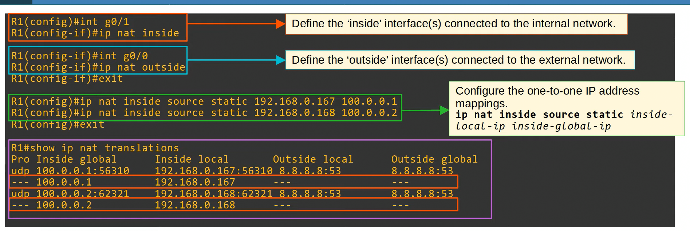

# NAT

Nat is used to modify the ip address of source and/or destination packets.

## The question is?

- How does NAT work. ie, how does it translate source (internal) ip address into destination (external) ip address. The translation doesn't have from internal to external.

## Configuring NAT/PAT (Jermey's IT Lab)

The following screenshot shows the example topology we worked with.


### 1. Static NAT

The following picture shows the commands necessary to configure static nat.



### 2. Dynamic NAT

The following picture shows the commands necessary to configure Dynamic nat.


### 3. PAT

The following picture shows the commands necessary to configure PAT.


### BONUS (How to Verify Config)

A\ Show NAT Table

```bash
show ip nat translations
```

> [!TIP]
> You can clear dynamic/extended entries using `clear ip nat translation *`

B\ Show NAT specific stats

```bash
show ip nat statistics
```

---

## Related to TP (Solution Steps)

### Activity 01

Ultimate goal is to assure routing. The steps are as follows:

1. Configure IP Addresses on interfaces.
2. Create Default routes where convenient.
3. Create Static routes otherwise.

> [!NOTE]
> I made everything available related to routing commands [here](https://hxuu.github.io/blog/misc/packettracer/#static-routing)

### Activity 02

#### 1. Configuration de NAT dynamique sur R1 avec pool de 22.23.24.10 jusqu’à 22.23.24.13


#### 2. Testez la connectivité entre PC et SERVER

```bash
ping <address-of-server>
```

* Wireshark result:


#### 3. Afficher la table NAT

```bash
R1#show ip nat translations
Pro Inside global      Inside local       Outside local      Outside global
--- 22.23.24.10        192.168.1.10       ---                ---
```

---

## Bonus Work (For Learning)

- Add a web server linked to R4 and assure connection to PC.

> [!WARNING]
> The server can be inside a docker container, and the instance inside gns3 is linked to the docker interface.
