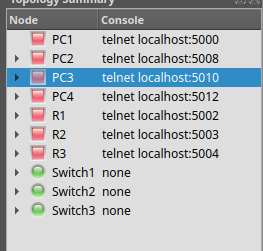

# OSPF Protocol 1st TP

> [!NOTE]
> The goal is to solve the TP.

## Activity 01

### 1. Replicate the network topology from the TP sheet into GNS3


### 2. Configurer les interfaces des routeurs

For this, I will connect to each router using `telnet`, and manage the windows using `tmux`

- Command for connecting to devices is:



```bash
telnet [OPTION...] [HOST [PORT]]
```

- Command to configure the interfaces:

```bash
R1(config)#interface X
R1(config-if)#ip address y.y.y.y w.w.w.w
R1(config-if)#no shutdown
```

> [!TIP]
> To verify your commands type: `show ip int b`

### 3. Configurer les identifiants des appareils ex : R1 c’est 1.1.1.1

Used in DR/BDR/DROTHER assignment as the 2nd priority.

```bash
R1(config)#router ospf 1
R1(config-router)#router-id 1.1.1.1

R1(config-router)#do show ip ospf
 Routing Process "ospf 1" with ID 1.1.1.1
```

> [!TIP]
> To update the router-id, use this command `clear ip ospf process` (it will lose the routing information for a while)

### 4. Configurer "OSPF"

```bash
R1(config)#router ospf 1
R1(config-router)#network 0.0.0.0 255.255.255.255 area 0
R1(config-router)#passive-interface f0/1

R1(config-router)#do show ip ospf int
FastEthernet0/1 is up, line protocol is up
  ...
  Timer...
    ...
    No Hellos (Passive interface)
```

### 5. Testez la connectivité entre PC1 et PC2

```bash
PC2> ping 11.11.11.10

11.11.11.10 icmp_seq=1 timeout
84 bytes from 11.11.11.10 icmp_seq=2 ttl=62 time=23.732 ms
84 bytes from 11.11.11.10 icmp_seq=3 ttl=62 time=26.307 ms
84 bytes from 11.11.11.10 icmp_seq=4 ttl=62 time=27.718 ms
84 bytes from 11.11.11.10 icmp_seq=5 ttl=62 time=26.608 ms
```

### 6. Consulter les tables de routage

```bash
R1#show ip route

Gateway of last resort is not set

     172.16.0.0/30 is subnetted, 1 subnets
C       172.16.28.0 is directly connected, Serial1/1
     192.168.5.0/30 is subnetted, 1 subnets
C       192.168.5.0 is directly connected, Serial1/0
     10.0.0.0/30 is subnetted, 1 subnets
O       10.10.10.0 [110/128] via 192.168.5.2, 00:15:50, Serial1/0
                   [110/128] via 172.16.28.1, 00:14:41, Serial1/1
     11.0.0.0/24 is subnetted, 1 subnets
O       11.11.11.0 [110/74] via 172.16.28.1, 00:14:41, Serial1/1
     12.0.0.0/24 is subnetted, 1 subnets
C       12.12.12.0 is directly connected, FastEthernet0/1
     13.0.0.0/24 is subnetted, 1 subnets
O       13.13.13.0 [110/74] via 192.168.5.2, 00:15:51, Serial1/0
```

### 5. Consulter les tables de voisinage

```bash
R1#show ip ospf neighbor

Neighbor ID     Pri   State           Dead Time   Address         Interface
3.3.3.3           0   FULL/  -        00:00:38    172.16.28.1     Serial1/1
2.2.2.2           0   FULL/  -        00:00:38    192.168.5.2     Serial1/0
```

## Activity 02

### 1. Modifier la bande passante des interfaces séries à 64 kbit/s

This will not affect the actual speed of the interface, but rather the metric that is called *cost* to favor one route over another.

```bash
configure terminal
interface s1/0
bandwidth 64
exit

R1#show int s1/0
Serial1/0 is up, line protocol is up
  Hardware is M4T
  Internet address is 192.168.5.1/30
  MTU 1500 bytes, BW 64 Kbit/sec, DLY 20000 usec,
```

### 2. Spécifier un coût pour OSPF

This will overwrite the default calculated cost.

```bash
configure terminal
interface s1/0
ip ospf cost 50
exit

R1(config-if)#do show ip ospf int s1/0
Serial1/0 is up, line protocol is up
  Internet Address 192.168.5.1/30, Area 0
  Process ID 1, Router ID 1.1.1.1, Network Type POINT_TO_POINT, Cost: 50
```

### 3. Configurer l’authentification OSPF

OSPF sends a Hello packet; the neighbor validates authentication. If valid, adjacency forms; otherwise, the packet is discarded.

```bash
configure terminal
interface s1/0
ip ospf authentication message-digest
ip ospf message-digest-key 1 md5 SECRET
exit
```

- Activer l’authentification dans OSPF

```bash
configure terminal
router ospf 1
area 0 authentication message-digest
exit
```

> [!WARNING]
> Type 1 Authentication makes it vulnerable to packet sniffing attacks, allowing an attacker to capture and read the password.

## Activity 03

### 1. Configuration OSPF avec un switch

- Exemple pour R1

```bash
configure terminal
interface GigabitEthernet0/0
ip address 192.168.3.1 255.255.255.0
no shutdown
exit
router ospf 1
network 192.168.3.0 0.0.0.255 area 0
exit
```

### 2. Configuration de la priorité OSPF

- Exemple pour donner la priorité la plus haute à R1 :

```bash
configure terminal
interface GigabitEthernet0/0
ip ospf priority 255
exit
```

### 3. Contrôle du processus de sélection OSPF

```bash
show ip ospf interface
```

### 4. Vérification du rôle DR/BDR/DROTHER

Before it was like this:


Then it's this:


```bash
show ip ospf neighbor
```

---

The End.
