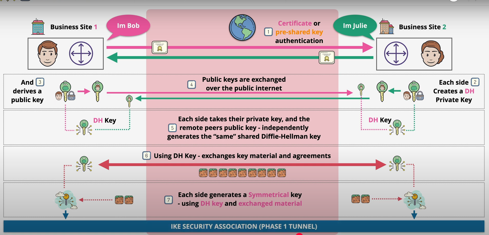
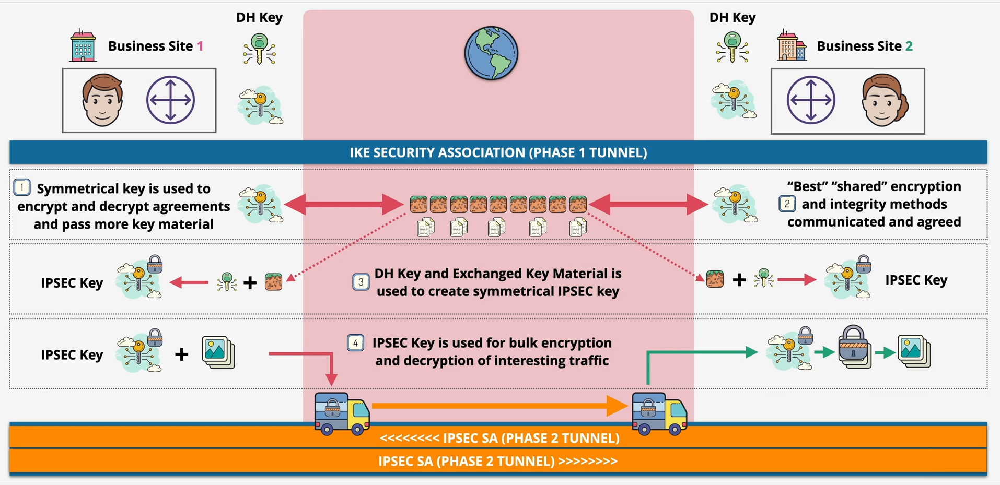

# VPN IPSec

The goal of IPSec VPNs is to create a secure channel called tunnel between two peers (ie routers) accross an insecure network like the internet.

IPSec provides authentication, ie only peers which are known to each other can exchange data. This data is obviously encrypted, which means that onlookers of this data see garbage.

## 1. Configuring the addresses of the router:

```bash
conf t
int X
ip address <ip-addr> <mask>
no shutdown
```

> [!TIP]
> To save the config in PCs do `save <filename>`, and for routers, `copy run start` and `write memory`

## Steps to create the IPSec VPN

### Create an ACL to permit the traffic that will go through the VPN.

This is an important step for the routers to match the *interesting traffic* that will
undergo encryption. The command for doing this is:

```bash
#access-list <id> permit ip FROM:<ip-premitted> <inverse-mask> TO:<ip-premitted> <inverse-mask>

# in R1
access-list 100 permit ip 192.168.1.0 0.0.0.255 192.168.3.0 0.0.0.255
# in R3
access-list 100 permit ip 192.168.3.0 0.0.0.255 192.168.1.0 0.0.0.255
```


### Phase 1: ISAKMP (Internet Security Association and Key Management Protocol)

This phase uses the IKE protocol to exchange keys. This is the slow and heavy part of the process. It where you initially authenticate (peers know each other) and share symmetric keys in a secured way.

All in all, this phase concerns creating a tunnel between peers and assigning them a symmetric key.

##### 1. Configure authentication using pre-shared keys

##### 2. Diffie-Hellman key step

This step is a so mathematically complex that I'll only touch upon on a very basic level.

After the peers authenticate, each one of them creates a pair of private/public keys and sends the public key, which is used to encrypt data only decryptable by the corresponding private key.

This step is important to then generate a DH key independentally in both machines using
the other side's public key as well as their private key. After this, agreements are exchanged
regarding the type of encryption used...etc, and a new, this time symmetric key is generated
from the previous step.

##### 3. Key exchange

The symmetric key has to be transfered securely. Here, the encryption algorithm specified
in the IKE policy is used to encrypted the rest of the data exchange.

> [!NOTE]
> The symmetric key is never transmitted across the network and is computed locally.

All the commands responsible for the configuration are:

```bash
crypto isakmp policy 10
 encryption aes 256
 authentication pre-share
 group 2 # Groups define the level of security of the key exchange -> 2 is moderate

crypto isakmp key cisco address <remote>
```

|  |
|:--:|
| *Phase 01: IKE* |


### Phase 2: IPsec Policy Parameters

This phase is about agreeing on the algorithm and key used to encrypt bulk data for transfer, ie getting the VPN up and running.

The transform set in IPSec VPNs is like a recipe that defines how the actual data (the stuff you care about) will be encrypted and protected as it travels through the VPN tunnel.

The commands for configuration of this phase are:

```bash
# phase 2 related
crypto ipsec transform-set VPN-SET esp-3des esp-sha-hmac

# tie it all together (phase1/2)
crypto map VPN-MAP 10 ipsec-isakmp
 set peer <remote>
 description SOME USEFUL DESCRIPTION
 set pfs group2
 set security-association lifetime seconds 86400
 set transform-set VPN-SET
 match address 100

# Activate VPN on a given interface
interface s1/0
 crypto map IPSEC-MAP
```

> [!WARNING]
> All configurations have to be done in both routers.

|  |
|:--:|
| *Phase 02: Generating New Key & Getting VPN Up And Running* |

---

Due is:

1. Test connectivity between hosts []
2. View ICMP packets using Wireshark []
3. Test connectivity between one host and another not included in the ACL []
